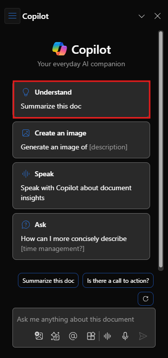

# Menyederhanakan dan mengekstrak informasi kunci dengan Copilot di Word

Untuk mulai menggunakan Microsoft 365 Copilot di Word, Anda dapat membuka panel **Copilot** dengan memilih ikon Copilot pada pita tab **Beranda** .

Fitur bermanfaat ini memberikan jawaban atas pertanyaan—luas atau spesifik—tentang dokumen Anda. Lakukan diskusi bolak-balik untuk mengulangi dan menyempurnakan hasil Anda, mendapatkan ringkasan atau informasi spesifik tentang konten dokumen, atau memintanya untuk menghasilkan ide, tabel, atau daftar yang dapat Anda salin dan sisipkan ke dalam dokumen Anda.

Dalam contoh berikut, kami mengubah permintaan dasar untuk Copilot di Word menjadi perintah kontekstual yang dibangun dengan baik yang memberi Anda apa yang Anda butuhkan, hanya dengan cara yang Anda butuhkan.

## Mari kita mulai membuat kerajinan tangan

Pertama, unduh **_[Market Analysis Report for Mystic Spice Premium Chai Tea.docx](https://go.microsoft.com/fwlink/?linkid=2268826)_**, lalu simpan file tersebut ke folder** OneDrive Anda**, jika hal tersebut belum dilakukan.

Buka dokumen di Word lalu buka panel **Copilot** dengan memilih ikon Copilot di tab **Beranda** pita. Masukkan perintah di bawah ini dan ikuti.

> [!NOTE]
> Perintah awal:
>
> _Ringkas dokumen Word ini._

Dalam perintah sederhana ini, Anda mulai dengan **Tujuan** dasar: _untuk meringkas dokumen Word._ Namun, tidak ada informasi tentang mengapa dokumen perlu diringkas atau untuk apa ringkasan diperlukan.

| Elemen | Contoh |
| :------ | :------- |
| **Perintah dasar:** Mulai dengan **Tujuan** | **Ringkas dokumen Word ini.** |
| **Perintah yang baik:** Tambahkan **Konteks** | Menambahkan **Konteks** dapat membantu Copilot memahami tujuan ringkasan dan menyesuaikan respons yang sesuai. _"dengan gambaran singkat tentang poin-poin utama untuk dibahas dengan tim saya selama pertemuan penjualan besok."_ |
| **Perintah yang lebih baik:** Tentukan **Sumber** | Menambahkan **Sumber** dapat membantu Copilot memahami dokumen atau bagian mana yang perlu diringkas dan memberikan respons yang lebih akurat. _“... bagian Analisis Kompetitif...”_ |
| **Perintah terbaik:** Berikan **Ekspektasi** yang jelas | Terakhir, menambahkan **Harapan** dapat membantu Copilot memahami cara memformat ringkasan dan tingkat detail apa yang diperlukan. _“Tolong ringkas menjadi 5 poin utama saja dan gunakan bahasa yang sederhana”_ |

> [!NOTE]
> **Perintah yang dibuat**:
>
> _Ringkaslah bagian Analisis Kompetitif dalam dokumen Word ini dengan ikhtisar singkat tentang hal-hal utama yang akan didiskusikan dengan tim saya selama Rapat penjualan besok. Batasi ringkasan hanya pada 5 hal utama dan gunakan bahasa yang sederhana._

Perintah ini memiliki semua detail yang dibutuhkan - **Tujuan**, **Konteks**, **Sumber**, dan **Harapan** - sehingga Copilot dapat memberi Anda jawaban yang Anda cari.

## Lihat selengkapnya

Cobalah perintah akhir yang kami buat, tetapi menggunakan dokumen Word Anda sendiri. Sesuaikan **Konteks**, **Sumber**, dan **Harapan** sehingga Anda dapat memperoleh informasi yang Anda butuhkan dari dokumen tersebut, tanpa hal tambahan yang tidak dibutuhkan.

Apa saja cara lain yang dapat Anda pikirkan untuk menambahkan konteks atau sumber atau harapan pada perintah Anda? Dapatkah Anda memikirkan strategi perintah lain yang dapat Anda gunakan untuk menghasilkan respons yang diinginkan?

> [!IMPORTANT]
> Fitur ini tersedia untuk pelanggan dengan lisensi Microsoft 365 Copilot atau Copilot Pro. Untuk informasi lebih lanjut, lihat [Selamat Datang di Copilot di Word](https://support.microsoft.com/office/welcome-to-copilot-in-word-2135e85f-a467-463b-b2f0-c51a46d625d1).

Di unit berikutnya, kita akan melihat cara membuat perintah serupa untuk Copilot di PowerPoint.
