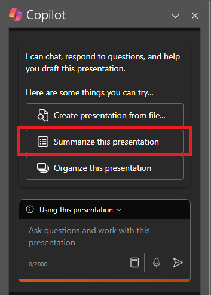

Microsoft 365 Copilot di PowerPoint adalah fitur dengan dukungan AI yang dapat membantu Anda membuat, mendesain, dan memformat slide Anda.  Anda dapat mengetik apa yang ingin Anda sampaikan dengan presentasi Anda, dan Copilot membantu Anda menyelesaikannya. 

Salinan dapat membantu Anda melewati slide kosong awal tersebut dan membuat Anda bergerak ke arah yang benar. Untuk mulai menggunakan Copilot di PowerPoint, Anda bisa membuka panel **Copilot** dengan memilih ikon Copilot di tab pita **Beranda** .

Dari panel Copilot, Anda bisa meminta presentasi dirangkum atau mengajukan pertanyaan tentang konten pada slide. Dalam contoh berikut, kita mulai dengan permintaan dasar untuk meringkas presentasi dan menambahkan elemen lain untuk membuat perintahnya lebih kuat.

## Mari kita mulai membuat kerajinan tangan

Pertama, unduh **_[Mystic Spice Premium Chai Market Analysis Presentation.pptx](https://go.microsoft.com/fwlink/?linkid=2268768)_** dan simpan file ke **folder OneDrive** Anda jika Anda belum melakukannya.

> [!NOTE]
> Perintah awal:
>
> _Ringkas presentasi PowerPoint ini._

Dalam perintah sederhana ini, Anda mulai dengan **Tujuan** dasar: _untuk meringkas PowerPoint._ Namun, tidak ada informasi tentang mengapa presentasi perlu diringkas atau untuk apa ringkasan diperlukan.

| Elemen | Contoh |
| :------ | :------- |
| Perintah dasar:  Mulai dengan **Tujuan** | **Ringkas presentasi PowerPoint ini.** |
| Perintah yang baik:  Tambahkan **Konteks** | Menambahkan **Konteks** dapat membantu Copilot memahami tujuan ringkasan dan menyesuaikan respons yang sesuai.  "_...untuk bos saya yang mencakup ringkasan poin utama sebelum bertemu dengan klien mereka._ |
| Perintah yang lebih baik:  Tentukan **Sumber** | Menambahkan **Sumber** dapat membantu Copilot memahami presentasi atau bagian mana yang perlu dirangkum dan memberikan respons yang lebih akurat.  "_...slide 5-10 dalam presentasi PowerPoint ini..._" |
| Perintah terbaik:  Tetapkan dengan jelas **Harapan** | Terakhir, menambahkan **Harapan** dapat membantu Copilot memahami cara memformat ringkasan dan tingkat detail apa yang diperlukan.  "_Silakan format poin utama sebagai daftar berpoin dan gunakan nada profesional._" |

> [!NOTE]
> **Perintah yang dibuat**:
>
> _Ringkas slide 5-10 dalam presentasi PowerPoint ini. untuk bos saya yang mencakup gambaran umum poin utama sebelum bertemu dengan klien mereka. Harap format poin-poin utama sebagai daftar berpoin dan gunakan nada yang profesional._

Dalam perintah ini, **Tujuan**, **Konteks**, **Sumber**, dan **Harapan** semuanya disediakan, sehingga Copilot dapat memberikan arahan yang cukup untuk menghasilkan respons yang sesuai dengan kebutuhan Anda.

## Lihat selengkapnya

Cobalah prompt terakhir menggunakan presentasi PowerPoint Anda sendiri Sesuaikan **Konteks**, **Sumber**, dan **Ekspektasi** sehingga Anda mendapatkan apa yang Anda butuhkan dari presentasi, tanpa hal tambahan yang tidak Anda butuhkan.

> [!IMPORTANT]
> Fitur ini tersedia untuk pelanggan dengan lisensi Microsoft 365 Copilot atau Copilot Pro. Untuk informasi selengkapnya, lihat [Selamat Datang di Copilot di PowerPoint](https://support.microsoft.com/office/welcome-to-copilot-in-powerpoint-57133c75-24c0-4519-8096-d0dadf25fb8d).
