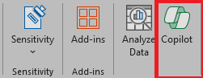
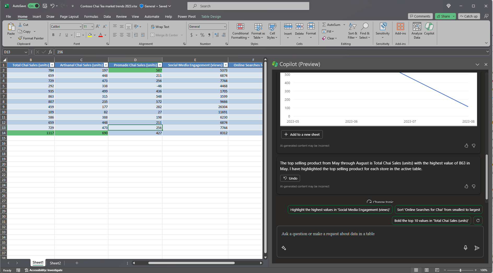

Microsoft 365 Copilot di Excel membantu Anda melakukan lebih banyak hal dengan data Anda di tabel Excel dengan menghasilkan saran kolom rumus, menampilkan wawasan dalam bagan dan PivotTable, dan menyoroti bagian data yang menarik. 

Di Excel, pilih **Copilot**  pada pita untuk membuka panel obrolan. Anda harus memiliki **tabel Excel** yang menyertakan data dalam lembar kerja sebelum menggunakan Copilot. 

Ubah rentang sel dengan cepat menjadi tabel Excel dengan mengikuti langkah-langkah berikut: 

1. Pilih sel atau rentang dalam data.

1. Pilih **Beranda > Format sebagai Tabel**.

1. Pada kotak dialog **Format sebagai Tabel** pilih kotak centang di samping **Tabel saya memiliki header** jika Anda ingin baris pertama dari rentang menjadi baris header.

1. Pilih **OK**.

## Mari kita mulai membuat kerajinan tangan

Pertama, unduh **_[tren pasar Contoso Chai Tea 2023.xlsx](https://go.microsoft.com/fwlink/?linkid=2268822)_** dan simpan file ke folder **OneDrive folder** jika Anda belum melakukannya.

Buka spreadsheet di Excel, lalu buka panel **Copilot** dengan memilih ikon Copilot pada tab **Beranda** di pita. Masukkan petunjuk di bawah ini dan ikuti petunjuknya.

> [!NOTE]
> Perintah awal:
>
> _Analisis tabel ini di Excel._

Dalam perintah sederhana ini, Anda mulai dengan **Tujuan**: dasar: _untuk menganalisis tabel Excel._ Namun, tidak ada informasi tentang mengapa tabel perlu diringkas atau untuk apa ringkasan diperlukan.

| Elemen | Contoh |
| :------ | :------- |
| Perintah dasar:  Mulai dengan **Tujuan** | **Analisis tabel ini di Excel.** |
| Perintah yang baik:  Tambahkan **Konteks** | Menambahkan **Konteks** dapat membantu Copilot memahami tujuan analisis dan menyesuaikan respons yang sesuai.  “_Kami mencari produk terlaris dari bulan Mei hingga Agustus untuk menginformasikan strategi pemasaran kami untuk tahun depan_” |
| Perintah yang lebih baik:  Tentukan **Sumber** | Menambahkan **Sumber** dapat membantu Copilot mempersempit cakupan dengan memberi tahunya untuk menggunakan informasi atau rentang tertentu.  "_...dari Mei sampai Agustus..._" |
| Perintah terbaik:  Tetapkan dengan jelas **Harapan** | Terakhir, menambahkan **Harapan** dapat membantu Copilot memahami cara memformat ringkasan dan tingkat detail apa yang diperlukan.  "_Harap sorot produk penjualan teratas dari bulan ke bulan._" |

> [!NOTE]
> **Perintah yang dibuat**:
>
> _Analisis tabel Excel ini. Kami mencari produk penjualan teratas dari bulan Mei hingga Agustus untuk menginformasikan strategi pemasaran kami untuk tahun depan. Harap sorot produk penjualan teratas dari bulan ke bulan._

Perintah ini memberikan Copilot semua yang dibutuhkan untuk menghasilkan jawaban yang baik, termasuk **Tujuan**, **Konteks**, **Sumber**, dan **Harapan**.

## Lihat selengkapnya

Cobalah perintah yang dibuat terakhir dan yang lainnya dengan tabel Excel Anda sendiri. Berikut adalah beberapa saran untuk perintah lain yang mungkin ingin Anda coba. Salin dan tambahkan **Konteks**, **Sumber**, dan **Harapan**.  

- Plot penjualan menurut kategori dari waktu ke waktu.

- Tampilkan total penjualan untuk setiap produk.

- Tampilkan total penjualan iklan untuk setiap wilayah pada tahun lalu.

> [!IMPORTANT]
> Fitur ini tersedia untuk pelanggan dengan lisensi Microsoft 365 Copilot atau Copilot Pro. Untuk mempelajari selengkapnya tentang tabel Excel dan cara membuatnya, lihat [Membuat tabel di Excel](https://support.microsoft.com/office/bf0ce08b-d012-42ec-8ecf-a2259c9faf3f). 