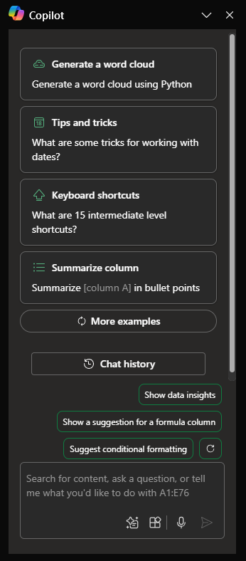

# Melihat tren dan memvisualisasikan data dengan Copilot di Excel

Microsoft 365 Copilot di Excel membantu Anda melakukan lebih banyak hal dengan data Anda di tabel Excel dengan menghasilkan saran kolom rumus, menampilkan wawasan dalam bagan dan PivotTable, dan menyoroti bagian data yang menarik.

Di Excel, pilih **Copilot**  pada pita untuk membuka panel obrolan.

Untuk menggunakan Copilot di Excel, data Anda harus diformat dengan salah satu cara berikut:

- Sebagai Tabel Excel
- Sebagai Rentang dukungan

Anda bisa membuat tabel, atau Anda bisa mengonversi sejumlah sel menjadi tabel jika Anda memiliki rentang data dengan mengikuti langkah-langkah berikut:

1. Pilih sel atau rentang dalam data.

1. Pilih **Beranda > Format sebagai Tabel**.

1. Pada kotak dialog **Format sebagai Tabel** pilih kotak centang di samping **Tabel saya memiliki header** jika Anda ingin baris pertama dari rentang menjadi baris header.

1. Pilih **OK**.

Jika Anda lebih suka menyimpan data Anda dalam rentang dan tidak mengonversinya ke tabel, data tersebut harus memenuhi semua persyaratan berikut:

- Hanya satu baris header
- Header hanya ada pada kolom, bukan pada baris
- Header unik; tidak ada header duplikat
- Tidak ada header kosong
- Data diformat dengan cara yang konsisten
- Tidak ada subtotal
- Tidak ada baris atau kolom kosong
- Tidak ada sel gabungan

Dalam contoh berikut, kita mulai dengan permintaan dasar untuk meringkas presentasi dan menambahkan elemen lain untuk membuat perintahnya lebih kuat.

## Mari kita mulai membuat kerajinan tangan

Pertama, unduh **_[tren pasar Contoso Chai Tea 2023.xlsx](https://go.microsoft.com/fwlink/?linkid=2268822)_** dan simpan file ke folder **OneDrive folder** jika Anda belum melakukannya.

Buka spreadsheet di Excel, lalu buka panel **Copilot** dengan memilih ikon Copilot pada tab **Beranda** di pita. Masukkan petunjuk di bawah ini dan ikuti petunjuknya.

> [!NOTE]
> Perintah awal:
>
> _Analisis tabel ini di Excel._

Dalam perintah sederhana ini, Anda mulai dengan **Tujuan**: dasar: _untuk menganalisis tabel Excel._ Namun, tidak ada informasi tentang mengapa tabel perlu diringkas atau untuk apa ringkasan diperlukan.

| Elemen | Contoh |
| :------ | :------- |
| **Perintah dasar:** Mulai dengan **Tujuan** | **Analisis tabel ini di Excel.** |
| **Perintah yang baik:** Tambahkan **Konteks** | Menambahkan **Konteks** dapat membantu Copilot memahami tujuan analisis dan menyesuaikan respons yang sesuai. _"Kami mencari produk terlaris dari bulan Mei hingga Agustus untuk penjualan chai artisan atau penjualan chai siap saji."_ |
| **Perintah yang lebih baik:** Tentukan **Sumber** | Menambahkan **Sumber** dapat membantu Copilot mempersempit cakupan dengan memberi tahunya untuk menggunakan informasi atau rentang tertentu. _"... dari Mei hingga Agustus untuk penjualan chai artisan atau penjualan chai siap saji...."_ |
| **Perintah terbaik:** Berikan **Ekspektasi** yang jelas | Terakhir, menambahkan **Harapan** dapat membantu Copilot memahami cara memformat ringkasan dan tingkat detail apa yang diperlukan. _"Harap rangkum produk penjualan teratas untuk setiap bulan."_ |

> [!NOTE]
> **Perintah yang dibuat**:
>
> _Analisa tabel ini di Excel. Kami mencari produk penjualan teratas dari Bulan Mei hingga Agustus untuk penjualan chai artisan atau penjualan chai siap saji. Tolong rangkum produk penjualan teratas untuk setiap bulan._

Perintah ini memberikan Copilot semua yang dibutuhkan untuk menghasilkan jawaban yang baik, termasuk **Tujuan**, **Konteks**, **Sumber**, dan **Harapan**.

## Lihat selengkapnya

Cobalah perintah yang dibuat terakhir dan yang lainnya dengan tabel Excel Anda sendiri. Berikut adalah beberapa saran untuk perintah lain yang mungkin ingin Anda coba. Salin dan tambahkan **Konteks**, **Sumber**, dan **Harapan**.  

- Plot penjualan menurut kategori dari waktu ke waktu.

- Tampilkan total penjualan untuk setiap produk.

- Tampilkan total penjualan iklan untuk setiap wilayah pada tahun lalu.

> [!IMPORTANT]
> Fitur ini tersedia untuk pelanggan dengan lisensi Microsoft 365 Copilot atau Copilot Pro. Untuk mempelajari selengkapnya tentang tabel Excel dan cara membuatnya, lihat [Membuat tabel di Excel](https://support.microsoft.com/office/bf0ce08b-d012-42ec-8ecf-a2259c9faf3f).
