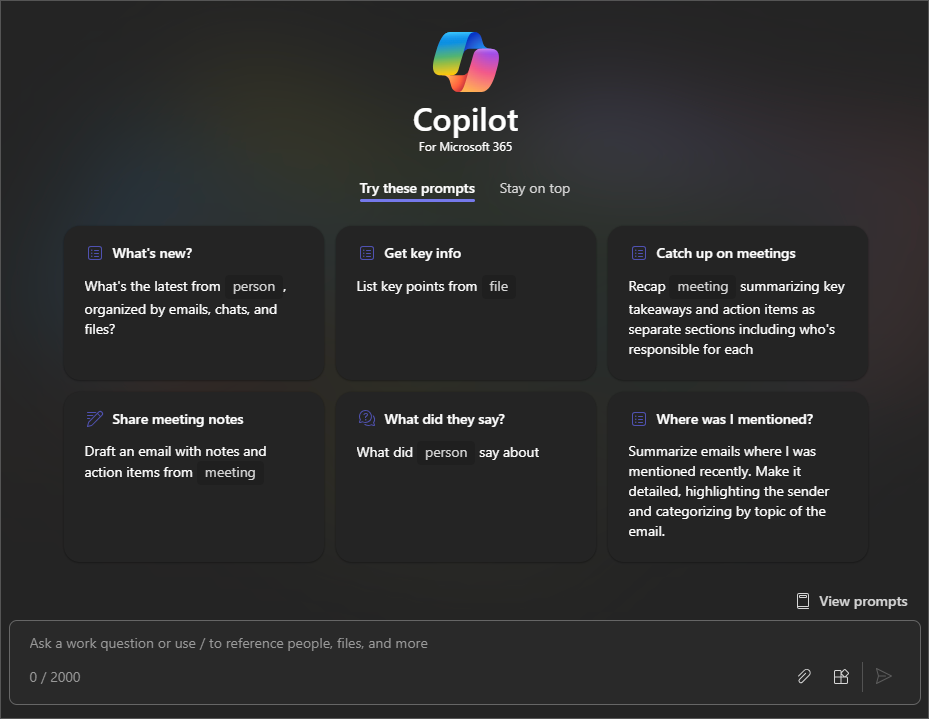

Obrolan bisnis Microsoft 365 menggabungkan kekuatan kecerdasan buatan (AI) dengan data kerja dan Aplikasi Anda untuk membantu Anda mewujudkan kreativitas, meningkatkan produktivitas, dan menambah keterampilan. Ini berfungsi di berbagai aplikasi dan konten, sehingga memberi Anda kekuatan AI bersama dengan data kerja Anda yang aman. Kemampuannya untuk meramu informasi dan menciptakan beragam hal dari berbagai sumber sekaligus memberdayakan Anda untuk mencapai tujuan dan sasaran yang lebih luas.

Sebagai perbandingan, Copilot di berbagai aplikasi Microsoft 365 (seperti Word atau PowerPoint) secara khusus dirancang untuk membantu Anda **dalam satu aplikasi**. Misalnya, Copilot di Word dirancang untuk membantu Anda membuat draf, mengedit, dan menggunakan konten dengan lebih baik. Di PowerPoint, Copilot tersedia untuk membantu Anda membuat presentasi yang lebih baik. Namun, dengan Obrolan Bisnis, kami dapat menggabungkan semuanya menjadi sebuah pengalaman baru.

Anda dapat mengakses Obrolan Bisnis dengan beberapa cara:

- Menggunakan Copilot di Microsoft Teams versi desktop dan seluler. Lihat [Menggunakan Obrolan Bisnis Microsoft 365 di Teams](https://support.microsoft.com/topic/open-microsoft-365-chat-in-teams-c6de0a62-4f9e-479d-b5f2-af036e342181)

- Akses Obrolan Bisnis Microsoft 365 di Microsoft.com/copilot. Lihat [Menggunakan Obrolan Bisnis Microsoft 365 di Microsoft.com/Copilot](https://support.microsoft.com/topic/use-microsoft-365-chat-at-microsoft365-com-or-in-the-microsoft-365-office-app-4a2538f9-962f-4c7c-a368-f6006bc13d6f)

## Mari kita mulai membuat kerajinan tangan

Menggunakan **Contoso CipherGuard Product Specification.docx** dari unit sebelumnya, buka Obrolan bisnis di Teams untuk mengerjakan permintaan berikutnya.

> [!NOTE]
> Perintah awal:
>
> _Membangun agenda rapat._

Dalam perintah sederhana ini, Anda mulai dengan **Tujuan** dasar: _menyusun agenda rapat_. Namun, tidak ada informasi tentang guna atau tujuan rapat.

| Elemen | Contoh |
| :------ | :------- |
| Perintah dasar:  Mulai dengan **Tujuan** | **_Membangun agenda rapat._** |
| Perintah yang baik:  Tambahkan **Konteks** | Menambahkan **Konteks** dapat membantu Copilot memahami mengapa Anda mengadakan rapat dan apa yang ingin Anda diskusikan.  "_...supaya rapat klien berlangsung satu jam, termasuk tujuan proyek, pernyataan misi, dan tanggal penyelesaian terjadwal._" |
| Perintah yang lebih baik:  Tentukan **Sumber** | Menambahkan **Sumber** dapat membantu Copilot mengetahui di mana mencari informasi tertentu.  "_Menggunakan informasi dari **/Contoso CipherGuard Product Specification.docx** dan cari item terbuka dan pertanyaan yang tidak terjawab._" |
| Perintah terbaik:  Tetapkan dengan jelas **Harapan** | Terakhir, menambahkan **Harapan** dapat membantu Copilot memahami bagaimana Anda ingin dokumen ditulis dan diformat.  "_Agenda harus dalam format tabel dengan penjatahan waktu, dan pastikan untuk memberikan orang kesempatan untuk mengajukan pertanyaan di akhir._" |

> [!NOTE]
> **Perintah yang dibuat**:
>
> _Bangun agenda rapat untuk rapat klien yang berlangsung satu jam, termasuk tujuan proyek, pernyataan misi, dan tanggal penyelesaian terjadwal. Gunakan informasi dari **/Contoso CipherGuard Product Specification.docx** dan cari item terbuka dan pertanyaan yang tidak terjawab. Agenda harus dalam format tabel dengan penjatahan waktu, dan pastikan untuk memberikan orang kesempatan untuk mengajukan pertanyaan di akhir._

Tinjau agenda dan buat penyesuaian atau penyempurnaan apa pun, lalu tambahkan ke undangan rapat Anda di Teams.

### Mereferensikan sumber

Seperti dalam contoh, jika Anda ingin Copilot mendasarkan presentasi baru Anda dari file, rapat, atau orang (bahkan ketiganya), Anda dapat memberi tahunya untuk melakukannya. Di jendela prompt, cukup mulai ketik garis miring "/" dan jendela popout akan menawarkan rapat, file, atau orang terbaru untuk direferensikan.

> [!IMPORTANT]
> Anda harus memiliki izin untuk mengakses file yang Anda referensikan, apakah file tersebut terletak di SharePoint atau OneDrive organisasi Anda dan bisa berupa file Word, Excel, atau PowerPoint.

## Lihat selengkapnya

Berikut adalah beberapa saran untuk perintah lain yang mungkin ingin Anda coba. Salin dan ubah agar sesuai dengan kebutuhan Anda.

- Apa yang terjadi dalam pertemuan terakhirku?

- Kejar obrolan yang belum dibaca.

- Buat draf pesan bahwa OKR akan jatuh tempo minggu depan.

- Beri tahu tim saya bagaimana kami memperbarui strategi produk.

- Ringkas obrolan, email, dan dokumen tentang eskalasi [pelanggan] yang terjadi semalam.

- Apa tonggak pencapaian berikutnya pada [sebuah proyek]? Apakah ada risiko? Bantu saya bertukar pikiran daftar beberapa cara potensial untuk mengurangi.

- Tulis ikhtisar perencanaan dalam gaya [a file] yang memuat garis waktu dari [a different file], lalu gabungkan daftar proyek dalam email dari [a person]. 
