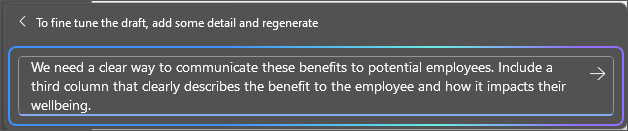

# Menulis, menata, dan mengubah konten menggunakan Microsoft 365 Copilot di Word

Microsoft 365 Copilot di Word memungkinkan Anda untuk tetap dalam alur ide sambil menyusun konten baru dan mengubah konten setelah Anda menulis ide. Copilot dapat menulis ulang teks Anda, termasuk penyesuaian untuk nada. Copilot juga dapat mengubah teks Anda menjadi tabel yang dapat diedit. Ikuti langkah-langkah untuk mengubah konten Anda di Word:

## Tulis ulang untuk nada

1. Pilih teks yang Anda inginkan untuk ditulis ulang Copilot.

1. Di margin kiri di samping teks Anda, pilih ikon **Salinan** .

1. Dari menu Copilot margin kiri, pilih **Tulis ulang**.

1. Copilot menunjukkan kepada Anda opsi yang akan ditulis ulang untuk dipilih.

1. Pilih **Ganti** untuk menggunakan teks yang direvisi, **Sisipkan di bawah ini** untuk menyisipkan teks yang ditulis ulang di bawah teks saat ini, **Regenerasi** untuk meregenerasi saran Copilot, atau **Sesuaikan nada** untuk menyesuaikan teks yang ditulis ulang untuk nada yang diinginkan.

    

## Teks ke tabel

1. Pilih teks yang Anda ingin Copilot mengubahnya menjadi tabel.

1. Di margin kiri di samping teks Anda, pilih ikon **Salinan** .

1. Dari menu Copilot margin kiri, pilih **Visualisasikan sebagai tabel**.

1. Copilot menunjukkan seperti apa tabel tersebut.

1. Pilih **Pertahankan** untuk menyisipkan tabel ke dalam dokumen Anda, **Regenerasi** untuk meregenerasi tabel Copilot, atau **Buang** untuk menghapus tabel.

1. Untuk menyempurnakan tabel, masukkan detail ke dalam kotak Tulis salinan untuk menyatakan apa yang harus diubah tentang tabel.

    1. Mengubah pemformatan tabel tidak didukung menggunakan kotak tulis, tetapi pemformatan tabel dapat diubah dengan menggunakan opsi tabel di pita Word.

    

Dalam contoh berikut, kita mulai dengan perintah sederhana untuk mengubah beberapa teks menjadi tabel dan menambahkan elemen di sepanjang jalan. Ikuti contoh menggunakan data Anda sendiri.

## Mari kita mulai membuat kerajinan tangan

Pertama, unduh **_[Graphic Design Institute - Employee Benefits.docx](https://go.microsoft.com/fwlink/?linkid=2268825)_**, lalu simpan file tersebut di **folder OneDrive** Anda jika hal tersebut belum dilakukan.

Buka dokumen di Word dan sorot semua teks dalam dokumen (tekan **Ctrl-A**). Dari menu Copilot margin kiri, pilih **Visualisasikan sebagai tabel**. Setelah membuat tabel, tindak lanjuti dengan Copilot menggunakan perintah di bawah ini untuk menyempurnakan hasil Anda.

> [!NOTE]
> Perintah awal:
>
> _Visualisasikan sebagai tabel._

Dalam perintah sederhana ini, Anda mulai dengan **Tujuan** dasar: _mengubah teks menjadi tabel._ Namun, tidak ada indikasi informasi apa yang Anda inginkan dalam tabel atau mengapa itu harus berupa tabel.

| Elemen | Contoh |
| :------ | :------- |
| **Perintah dasar:** Mulai dengan **Tujuan** | **_Visualisasikan sebagai tabel._** |
| **Perintah yang baik:** Tambahkan **Konteks** | Menambahkan **Konteks** dapat membantu Copilot memahami jenis data yang akan dilihat dan untuk apa data tersebut akan digunakan. _"Kita membutuhkan cara yang jelas untuk menyampaikan manfaat ini kepada calon karyawan."_ |
| **Perintah yang lebih baik:** Tentukan **Sumber** | **Sumber** dalam contoh ini adalah seluruh teks pada **Graphic Design Institute - Employee Benefits.docx**. |
| **Perintah terbaik:** Berikan **Ekspektasi** yang jelas | Terakhir, menambahkan **Harapan** dapat membantu Copilot memahami bagaimana Anda ingin tabel diatur dan ditulis. _"Sertakan kolom ketiga yang dengan jelas menguraikan keuntungan bagi karyawan dan bagaimana hal itu memengaruhi kesejahteraan mereka."_ |

> [!NOTE]
> **Perintah yang dibuat**:
>
> _Visualisasikan sebagai tabel. Kami membutuhkan cara yang jelas untuk mengkomunikasikan keuntungan ini kepada karyawan potensial. Sertakan kolom ketiga yang dengan jelas menjelaskan manfaat bagi karyawan dan bagaimana hal itu berdampak pada kesehatan mereka._

Perintah ini memberikan Copilot semua yang dibutuhkan untuk menghasilkan jawaban yang baik, termasuk **Tujuan**, **Konteks**, **Sumber**, dan **Harapan**.

> [!IMPORTANT]
> Fitur ini tersedia untuk pelanggan dengan lisensi Microsoft 365 Copilot atau Copilot Pro. Untuk informasi selengkapnya, lihat [Mengubah konten Anda dengan Copilot di Word](https://support.microsoft.com/office/transform-your-content-with-copilot-in-word-923d9763-f896-4da7-8a3f-5b12c3bfc475).
