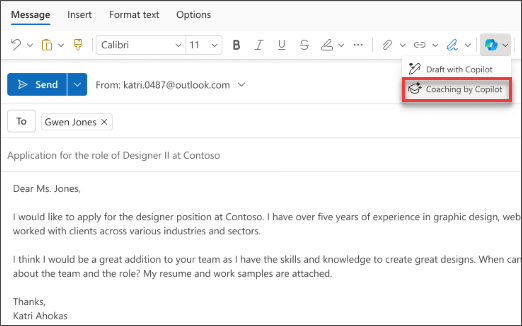

# Menulis ulang pesan dan balasan untuk nada menggunakan Microsoft 365 Copilot di Outlook

Memiliki email penting untuk ditulis dan ingin merasa yakin bahwa itu secara efektif menyampaikan pesan yang Anda maksudkan? Dengan Copilot di Outlook, Anda bisa mendapatkan saran bermanfaat tentang cara menyesuaikan nada, kejelasan, dan sentimen pembaca sebelum Anda mencapai kirim.

1. Di Outlook, pilih **Beranda > Email Baru > Email**. Ketik pesan email Anda.

1. Pilih ikon **Copilot** dari toolbar. Pilih **Coaching by Copilot** dari menu drop-down.

    

1. Copilot meninjau email Anda dan menawarkan saran tentang meningkatkan nada, kejelasan, dan sentimen pembaca.

1. Jika Anda menyukai salah satu atau semua saran, masukkan umpan balik ke dalam draf. Saat Anda puas, kirim email Anda.

    

Dalam contoh berikut, kita mulai dengan perintah sederhana dan menambahkan elemen di sepanjang jalan. Ikuti contoh setelah menggunakan Copilot untuk membuat draf email.

## Mari kita mulai membuat kerajinan tangan

**Pertama, minta Copilot di Outlook untuk membuat draf email fiktif** dengan perintah berikut:  

> _Buat draf pengumuman pembaruan produk singkat untuk pelanggan tentang rilis perangkat lunak terbaru kami. Sorot fitur kunci baru, peningkatan, dan bagaimana itu menguntungkan pengguna._  

> [!NOTE]
> Perintah awal:
>
> _Tinjau email ini dan buat saran untuk meningkatkannya._

Dalam perintah sederhana ini, Anda mulai dengan **Tujuan** dasar: _untuk menyempurnakan email_. Namun, tidak banyak detail yang disebutkan mengenai penyempurnaan seperti apa yang diperlukan.  

| Elemen | Contoh |
| :------ | :------- |
| **Perintah dasar:** Mulai dengan **Tujuan** | **_Buat email ini lebih formal._** |
| **Perintah yang baik:** Tambahkan **Konteks** | Menambahkan **Konteks** membantu Copilot memahami tujuan email dan jenis peningkatan apa yang diperlukan. _"... sehingga terdengar lebih profesional dan dipoles sambil mempertahankan nada yang hangat dan menarik."_ |
| **Perintah yang lebih baik:** Tentukan **Sumber** | **Sumber** untuk perintah ini adalah email yang telah Anda buat di Outlook. _"... email ini."_ |
| **Perintah terbaik:** Berikan **Ekspektasi** yang jelas | Menambahkan **Ekspektasi** membantu Copilot memahami perubahan yang diinginkan. _"Pastikan emailnya profesional, ringkas, dan menyoroti detail utama pembaruan produk dengan jelas."_ |

> [!NOTE]  
> **Perintah yang dibuat**:  
>
> _Buat email ini lebih formal. Pastikan emailnya profesional, ringkas, dan menyoroti detail utama pembaruan produk dengan jelas._  

Perintah ini memberikan Copilot semua yang dibutuhkan untuk menghasilkan jawaban yang baik, termasuk **Tujuan**, **Konteks**, **Sumber**, dan **Harapan**.
